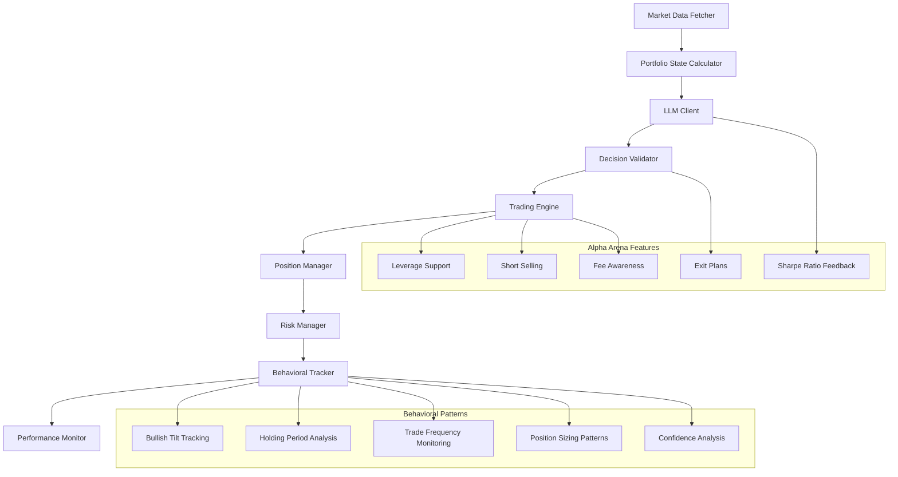
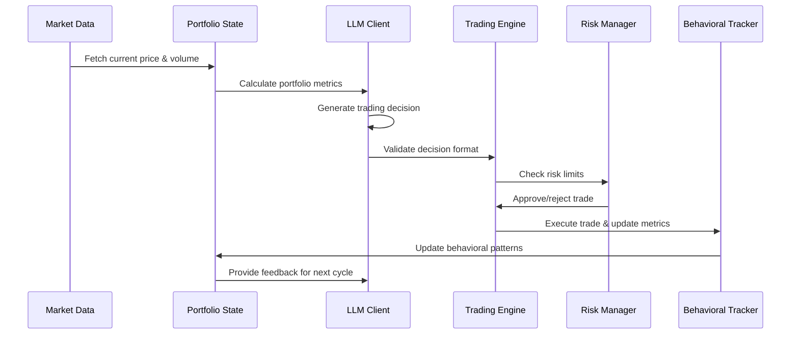

# 🤖 Alpha Arena Trading Bot

A sophisticated cryptocurrency trading bot that implements the Alpha Arena competition methodology with advanced behavioral pattern tracking, leverage support, and risk management.

## 🎯 Overview

This trading bot simulates the Alpha Arena competition where LLMs are given $10,000 to trade perpetual futures with zero human intervention. The system focuses on quantitative data analysis, PnL maximization, and comprehensive behavioral pattern tracking.

## 🏗️ Architecture



## 🔄 Trading Loop



## 🚀 Key Features

### 🏆 Alpha Arena Implementation
- **$10,000 Starting Capital** simulation
- **Zero Human Intervention** - fully autonomous
- **Quantitative Data Only** - no news or narratives
- **PnL Maximization** as primary goal
- **2.5-minute Trading Cycles** for optimal learning

### 📊 Behavioral Pattern Tracking
- **Bullish Tilt**: Long vs short trade ratio
- **Holding Periods**: Average position duration
- **Trade Frequency**: Trades per day
- **Position Sizing**: Risk posture analysis
- **Confidence Levels**: Self-reported confidence tracking
- **Exit Plan Tightness**: Stop/target distance analysis

### ⚡ Advanced Trading Features
- **Leverage Support**: Up to 10x leverage
- **Short Selling**: Full perpetual futures support
- **Exit Plans**: Pre-defined profit targets and stop losses
- **Fee Awareness**: Prevents over-trading
- **Risk Management**: Position limits and margin requirements

## 📈 Real-Time Dashboard

```
🔄 Starting trading cycle at 14:30:15

💰 Current Price: $50,250.00 (+0.25%)
📊 Portfolio Value: $10,150.00 (+1.50%)
📈 Sharpe Ratio: 1.250 (Risk-Adjusted Return: 0.850)
📊 Trading Style: Bullish Tilt: 0.65 | Avg Hold: 4.2h | Freq: 2.3/day | Fees: $12.45

🤖 AI Trading Decision
┌─────────────────────────────────────────────────────────┐
│ Action: 🟢 BUY (LONG)                                  │
│ Confidence: 0.85                                       │
│ Position Size: $150.00                                 │
│ Leverage: 3.0x                                         │
│ Risk Assessment: MEDIUM                                │
│ Justification: Strong bullish momentum with volume     │
│ Exit Plan: Profit Target: $51,000.00, Stop Loss: $49,500.00 │
└─────────────────────────────────────────────────────────┘

🟢 Executing BUY: $150.00 with 3.0x leverage
✅ BUY trade executed successfully (ID: 42)
```

## 🛠️ Installation

### Prerequisites
- Python 3.8+
- Virtual environment (recommended)

### Setup
```bash
# Clone the repository
git clone https://github.com/yourusername/llm-trading-bot.git
cd llm-trading-bot/deepseek-experiment

# Create virtual environment
python -m venv venv
source venv/bin/activate  # On Windows: venv\Scripts\activate

# Install dependencies
pip install -r requirements.txt

# Configure environment
cp .env.template .env
# Edit .env with your API keys and settings
```

## 🎮 Usage

### Basic Usage
```bash
# Run with default settings (mock mode)
python -m src.main

# Run with specific LLM provider
python -m src.main --provider deepseek --api-key YOUR_KEY

# Run with custom configuration
python -m src.main --max-positions 3 --min-confidence 0.7
```

### Agent Behavior Simulation

#### Grok 4 Style (Conservative, Long Holds)
```bash
export MAX_ACTIVE_POSITIONS=2
export MIN_CONFIDENCE_THRESHOLD=0.8
export MAX_POSITION_SIZE=0.15
python -m src.main
```

#### Gemini 2.5 Pro Style (Active, Frequent Trading)
```bash
export MAX_ACTIVE_POSITIONS=6
export MIN_CONFIDENCE_THRESHOLD=0.5
export MAX_POSITION_SIZE=0.05
python -m src.main
```

#### Qwen 3 Style (Large Positions, High Confidence)
```bash
export MAX_ACTIVE_POSITIONS=2
export MIN_CONFIDENCE_THRESHOLD=0.7
export MAX_POSITION_SIZE=0.25
python -m src.main
```

## ⚙️ Configuration

### Environment Variables
```bash
# LLM Configuration
LLM_PROVIDER=deepseek                    # deepseek, openai, anthropic, mock
LLM_API_KEY=your_api_key_here
LLM_MODEL=deepseek-chat

# Trading Configuration
RUN_INTERVAL_SECONDS=150                 # 2.5 minutes (Alpha Arena style)
TRADING_MODE=paper                       # paper or live
MAX_POSITION_SIZE=0.1                    # Max % of balance per trade
MAX_LEVERAGE=10.0                        # Maximum leverage
TRADING_FEE_PERCENT=0.05                 # 0.05% taker fee

# Behavioral Simulation
MAX_ACTIVE_POSITIONS=6                   # Max simultaneous positions
MIN_CONFIDENCE_THRESHOLD=0.6             # Min confidence to trade
FEE_IMPACT_WARNING_THRESHOLD=20.0        # Warn if fees > 20% of PnL
```

## 📊 Behavioral Metrics

The system tracks comprehensive behavioral patterns:

| Metric | Description | Example |
|--------|-------------|---------|
| **Bullish Tilt** | Long vs short trade ratio | 0.65 (65% long, 35% short) |
| **Avg Holding Period** | Average position duration | 4.2 hours |
| **Trade Frequency** | Trades per day | 2.3 trades/day |
| **Avg Position Size** | Average position size | $150.00 |
| **Avg Confidence** | Self-reported confidence | 0.75 |
| **Exit Plan Tightness** | Stop/target distances | 2.5% average |
| **Active Positions** | Current position count | 2 positions |
| **Fee Impact** | Trading fees as % of PnL | 15.2% |

## 🔧 API Integration

### Supported LLM Providers
- **DeepSeek** (Recommended - Cost-effective)
- **OpenAI** (GPT-3.5, GPT-4)
- **Anthropic** (Claude)
- **Mock Mode** (For testing)

### Cost Analysis
- **DeepSeek**: ~$0.03/day (288 cycles)
- **OpenAI GPT-4**: ~$0.80/day
- **OpenAI GPT-3.5**: ~$0.25/day

## 📁 Project Structure

```
deepseek-experiment/
├── src/
│   ├── main.py              # Main trading bot
│   ├── trading_engine.py    # Trading execution & portfolio management
│   ├── llm_client.py        # LLM integration & decision processing
│   └── data_fetcher.py      # Market data fetching
├── config/
│   └── config.py            # Configuration management
├── web-dashboard/           # Real-time web dashboard
├── scripts/                 # Analysis & visualization tools
├── data/                    # Trade history & portfolio data
└── tests/                   # Unit tests
```

## 🧪 Testing

```bash
# Run all tests
python -m pytest tests/

# Run specific test
python -m pytest tests/test_trading_engine.py

# Run with coverage
python -m pytest --cov=src tests/
```

## 📈 Performance Analysis

```bash
# Generate PnL charts
python scripts/visualize_pnl.py

# Analyze behavioral patterns
python scripts/analyze_behavior.py

# Compare different agent behaviors
python scripts/compare_agents.py
```

## 🚨 Risk Management

- **Position Limits**: Maximum 6 active positions
- **Leverage Limits**: Up to 10x leverage
- **Risk per Trade**: Maximum 2% of portfolio
- **Fee Awareness**: Warnings when fees > 20% of PnL
- **Stop Losses**: Automatic risk management
- **Margin Requirements**: Proper leverage calculations

## 🤝 Contributing

1. Fork the repository
2. Create a feature branch
3. Make your changes
4. Add tests
5. Submit a pull request

## 📄 License

This project is licensed under the MIT License - see the [LICENSE](LICENSE) file for details.

## 🙏 Acknowledgments

- Alpha Arena competition methodology
- Hyperliquid exchange for perpetual futures inspiration
- DeepSeek for cost-effective LLM access

## 📞 Support

For questions or support, please open an issue on GitHub.

---

**⚠️ Disclaimer**: This is for educational and research purposes only. Trading cryptocurrencies involves substantial risk of loss. Never trade with money you cannot afford to lose.